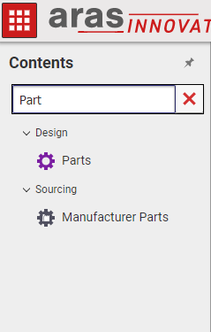

# TOC Search Bar

The TOC Search Bar projects adds a search bar to the standard table of contents to allow users to more easily find the ItemTypes they are looking for.

## Project Details

**Built Using:** Aras 12.0
**Browsers Tested:** Internet Explorer 11, Edge, Chrome

> Please note that each release of this project is version-dependent. To avoid potential errors, please ensure that you download the release of this project corresponding to your installed version of Aras Innovator.

## History
Release | Notes
--------|--------
[v12.0](https://github.com/ArasLabs/toc-search-bar/releases/tag/12.0) | Update for 12.0
[v11.0SP15](https://github.com/ArasLabs/toc-search-bar/releases/tag/11.0SP15) | Update for SP15
[v11.0SP12](https://github.com/ArasLabs/toc-search-bar/releases/tag/11.0SP12) | Update for SP12
[v11.0SP11](https://github.com/ArasLabs/toc-search-bar/releases/tag/11.0SP11) | First release.

#### Supported Aras Versions

Project | Aras
--------|------
[v12.0](https://github.com/ArasLabs/toc-search-bar/releases/tag/12.0) | 12.0
[v11.0SP15](https://github.com/ArasLabs/toc-search-bar/releases/tag/11.0SP15) | 11.0 SP15
[v11.0SP12](https://github.com/ArasLabs/toc-search-bar/releases/tag/11.0SP12) | 11.0 SP12
[v11.0SP11](https://github.com/ArasLabs/toc-search-bar/releases/tag/11.0SP11) | 11.0 SP11

## Installation

#### Important!
**Always back up your code tree and database before applying an import package or code tree patch!**

### Pre-requisites

1. Aras Innovator installed (version 12.0)

### Install Steps

1. Backup your code tree
	* This project makes modifications to core files, so it is highly recommended that you backup your files first
2. Copy the `/Innovator/` folder in your local TOC Search Bar repository
3. Paste this folder to the root of your code tree
	* This should be the same folder that contains the `InnovatorServerConfig.xml`
4. Open the `/Innovator/Client/web.config` in a text editor
5. Increment the `filesRevision` attribute of the `<cachingModule>` tag in this file
	* _std->2, 2->3, 3->4, etc._

You are now ready to login to Aras and try out this TOC Search Bar.

## Usage

1. Log in to Aras as admin.
2. Confirm that you can see a new textbox at the top of the TOC
3. Begin typing into this textbox
4. Notice that the TOC filters itself dynamically as you type
5. Click the red 'X' button in this textbox to clear it and reset the TOC
6. Manually deleting all of the text will also reset the TOC

## Contributing

1. Fork it!
2. Create your feature branch: `git checkout -b my-new-feature`
3. Commit your changes: `git commit -am 'Add some feature'`
4. Push to the branch: `git push origin my-new-feature`
5. Submit a pull request

For more information on contributing to this project, another Aras Labs project, or any Aras Community project, shoot us an email at araslabs@aras.com.

## Credits

Project written, documented, and published by Christopher Gillis at Aras Labs. @csgillis-aras

## License

Aras Labs projects are published to Github under the MIT license. See the [LICENSE file](./LICENSE.md) for license rights and limitations.